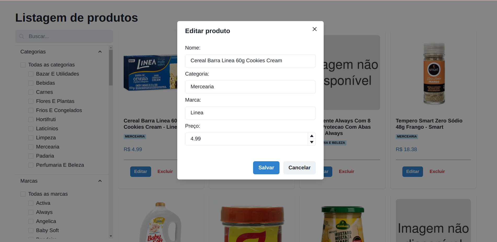
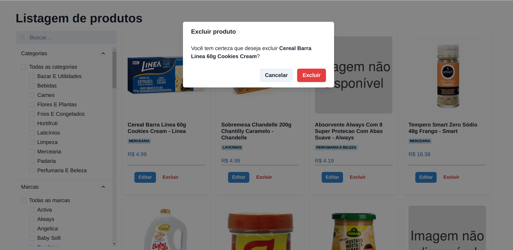
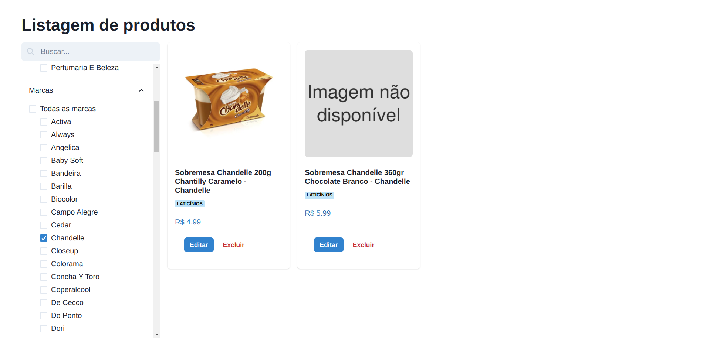

# Products APP

This is a products APP built using [React.js](https://react.dev/), [Vite](https://vitejs.dev/), [Typescript](https://www.typescriptlang.org/) and [Chakra UI](https://v2.chakra-ui.com/).

## Prerequisites

- Local API running (follow the docs) (https://github.com/ingridflack/products-api/blob/main/README.md)
- Node
- Npm 

## Installation

1. Clone the repository:

    ```bash
    git clone https://github.com/ingridflack/products-app.git
    ```
2. Add a .env file following the example below:
    ```bash
   VITE_BASE_URL_LOCAL=http://localhost:3000 
    ```
3. Install the dependencies:
    ```bash
    npm install
    ```    
4. Run `npm run dev` to build and run the containers

## Features







## Roadmap

- Unit tests;